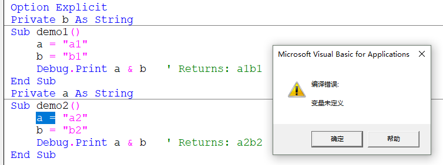
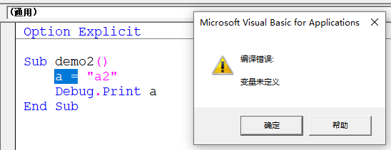
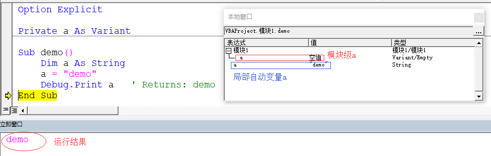

# L01 变量作用域与生命期

[TOC]

## 1. 内容概要

### 1.1. 精讲内容：

- VBA 数组与字典（精）
- 窗体与控件（精）
- SQL 语言的应用与 ADO 对象（精）
- VBA 网页采集初步与正则表达式入门（略）
- 递归、类模块与 API 入门（略）


### 1.2. 注意事项：

1. 数组与字典：解决复杂问题、执行效率最高（而非开发效率最高）的解决方案。根据 EH 论坛灰袍法师的极限测试，当字典中不同的键超过 100 万条后，执行效率也会下降。
2. VBA 窗体样式陈旧，为何还要学习？为了实现数据与逻辑的分离，不让用户直接接触提交表单。
3. ADO 对象：针对微软数据库的访问接口
4. 网抓与正则：VBA 缺乏基础库（轮子），开发效率不如 Python，仅简单介绍
5. 进阶班学员：不要止步于 Excel VBA，编程的世界更精彩


## 2. 再谈变量

VBA 编程最重要的，是思路

### 2.1. 局部自动变量

用 `Dim` 变量，准确讲，叫**局部自动变量**——

- 作用域是局部的，只存在于当前的 `Sub` 过程或 `Function` 函数中
- 生存期是随着当前的`Sub` / `Function`的终止自动终止的

```vb
Sub Demo()
    Dim a, i As Long
    a = 5
    For i = 1 To 3
        Call callDemo(a)
    Next
End Sub
Sub callDemo(b)
    Dim count As String
    Debug.Print b & "   " & count & 1
    count = count & 1
End Sub
' Returns:
' 5   1
' 5   1
' 5   1
```


### 2.2. 局部静态变量

需求：统计 `callDemo` 的调用次数

用 `Static` 声明的变量，叫**局部静态变量**——

- 作用域是局部的
- 生存期是与整个程序**同始同终**的

```vb
Sub Demo()
    Dim a, i As Long
    a = 5
    For i = 1 To 3
        Call callDemo(a)
    Next
End Sub
Sub callDemo(b)
    '定义为局部静态变量
    Static count As Long
    Debug.Print b & "   " & count & 1
    count = count & 1
End Sub
' Returns:
'5   01
'5   11
'5   111
```

注意：VBA 中，静态变量**没有**【全局】的说法，因此**没有全局静态变量**（不支持），而是单独分配了一段

编译原理：（1:09:00）

计算机内存中有四个区域：

1. 代码区：存放代码及库函数
2. 数据区：存放程序数据，和程序同始同终
3. 栈区：处理不同 `Sub` 或 `Function` 的调用，每个栈区内有一个区域，用于存放**局部自动变量**
4. 堆区：（下节讲）

计算机内存设有**代码区**与**数据区**，前者存放代码及库函数；后者存放程序数据，和程序同始同终。数据区会开辟一个新栈，专门用于存放局部静态变量。除了代码区和数据区，程序运行过程中，还会新开辟一个区域叫**栈区**，用于处理不同 `Sub` 或 `Function` 的调用，每个栈区内有一个区域，用于存放**局部自动变量**，当 `Sub` 或 `Function` 执行结束后销毁。


### 2.3. 模块级变量

用 `Private` 声明的变量，是**模块级变量**——

- 作用域在**当前模块**中都有效
- 生存期是与**整个程序**同始同终的

在声明除 `Sub` 或 `Function` 之外的模块级变量时，也可以用 `Dim` 声明（强烈不推荐）：

```vb
Option Explicit
Dim a As String
Private b As String
Sub demo1()
    a = "a1"
    b = "b1"
    Debug.Print a & b   ' Returns: a1b1
End Sub
Sub demo2()
    a = "a2"
    b = "b2"
    Debug.Print a & b   ' Returns: a2b2
End Sub
```

但要注意声明的位置必须是在所有 `Sub` 或 `Function` 之前，否则报错：

```vb
Option Explicit
Private b As String
Sub demo1()
    a = "a1"
    b = "b1"
    Debug.Print a & b   ' Returns: a1b1
End Sub
Private a As String
Sub demo2()
    a = "a2"
    b = "b2"
    Debug.Print a & b   ' Returns: a2b2
End Sub
```

运行 `demo2` 结果：




理解模块（Module）：

> **跨模块访问实例**
>
> 在【模块1】声明模块级变量 `a` ，再到【Sheet1】的过程 `demo2` 中访问 `a`：

```vb
'Module1:
Option Explicit
Private a As String
Sub demo1()
    a = "a1"
    Debug.Print a   ' Returns: a1
End Sub
```

```vb
Option Explicit
Sub demo2()
    a = "a2"
    Debug.Print a   ' (Error)
End Sub
```

运行 `demo2` 的结果：




### 2.4. 全局变量

用 `Public` 声明的变量，叫**全局变量**——

- 作用域是整个 Excel 程序
- 生命期与整个 Excel 程序同始同终

上例若要实现跨模块访问变量，要改用 `Public` 声明该变量：

```vb
'Module1:
Option Explicit
' Use Public instead
Public a As String
Sub demo()
    a = "a1"
    Debug.Print a   ' Returns: a1
End Sub
```

```vb
'Sheet1:
Option Explicit
Sub demo2()
    a = "a2"
    Debug.Print a   'Returns: a2
End Sub
```

注意事项：

1. 不同模块间的全局变量如果重名，需要在变量前指定模块名称；
2. `Private` 与 `Public` 除了修饰变量，还可以定义 `Sub` 和 `Function` 的作用域；如果不加修饰符，默认都是全局的；
3. 局部静态变量的重置是通过程序结束实现的，即 `End` 语句或 `End` 按钮；
4. 被 `Private` 修饰的过程或函数，只能在该作用域内被调用，这样可以保护程序中的私有过程或函数不被其他位置混用；


### 2.5. 变量的应用原则

- 尽量少使用全局变量，如果可以在模块内部解决就不要用全局变量；
- 若能使用局部变量，就不要用模块级变量；

变量的作用域要**尽量精确，越小越好**。（不仅限于 VBA）


### 2.6. 变量的阴影效应

变量应用的就近原则：比较近声明的同名变量起作用。

阴影效应仅与**变量名有关**，与变量的**数据类型无关**。

```vb
Option Explicit

Private a As Variant

Sub demo()
    Dim a As String
    a = "demo"
    Debug.Print a   ' Returns: demo
End Sub
```

运行结果：



通过逐句执行时的【本地窗口】发现：

模块级 `a` 并非消失，真正被赋值的是局部变量 `a`。前者的“阳光”被后者遮蔽（留下阴影）


---

---


## 3. 作业

### 3.1. 教室排课表高亮显示

已知各教师上课科目、授课班级，在全年级课程总表中高亮显示一周的上课地点，并统计一周课时总数。

```vb
Option Explicit
'热身1：高亮显示不同老师在不同班级的指定课程，并统计课时数
'【高一下学期2014.1.23】工作表事件代码：
Private Sub Worksheet_Change(ByVal keyWord As Range)
    If Intersect(keyWord, [F3:J3]) Is Nothing Then Exit Sub
    Call Ex01_CoursesHighlight
End Sub
'标准模块代码：
Sub Ex01_CoursesHighlight()
    Application.ScreenUpdating = False
    Dim courses As Range, iCourse As Range, classes As Range
    Dim classNo As Double, classCount As Double
    '1.初始化工作
    Set classes = [M3].Resize(1, 9)
    Set courses = [C10:BD11, C13:BD14, C16:BD18, C25:AL26, C28:AL29, C31:AL33]
    courses.Interior.ColorIndex = xlAutomatic
    courses.Font.ColorIndex = xlAutomatic
    '2.遍历所有课程，分两步判定
    For Each iCourse In courses
        If iCourse.Text = [K3].Text Then
            classNo = Cells(8, iCourse.Column)
            If Application.WorksheetFunction.CountIf(classes, classNo) > 0 Then
                classCount = classCount + 1
                iCourse.Interior.Color = vbRed
                iCourse.Font.Color = vbYellow
            End If
        End If
    Next iCourse
    [Y3].Value = classCount
    Application.ScreenUpdating = True
End Sub
```


### 3.2. 模糊查询全年级学生成绩

现有1班~5班的学生成绩，分别位于五张工作表；要求在查询页（工作表）中输入分数或姓名关键字，自动显示这五个班中分数相同或姓名包含该关键字的所有学生成绩，并注明所在班级：

```vb
'热身2：根据姓名和分数模糊查询五个班的成绩
'【查询界面】工作表事件代码：
Private Sub Worksheet_Change(ByVal keyWord As Range)
    If Intersect(keyWord, [A2]) Is Nothing Then Exit Sub
    Call Ex02_FuzzySearch
End Sub
'标准模块代码：
Sub Ex01_2FuzzySearch1()
    Dim sht As Worksheet, resultSheet As Worksheet, keyWord As Variant, rng As Range, k%
    Set resultSheet = Worksheets("查询界面")
    resultSheet.UsedRange.Offset(1, 1).ClearContents
    keyWord = resultSheet.[A2]
    k = 1
    For Each sht In ThisWorkbook.Worksheets
        If sht.Name Like "?班" Then
            If TypeName(keyWord) = "String" Then
                For Each rng In sht.UsedRange.Columns(1).Cells
                    If rng.Text Like ("*" & keyWord & "*") Then
                        k = k + 1
                        resultSheet.Cells(k, 2) = sht.Name
                        sht.UsedRange.Rows(rng.Row).Copy resultSheet.Cells(k, 3)
                    End If
                Next
            Else
                For Each rng In sht.UsedRange.Columns(2).Cells
                    If keyWord = rng Then
                        k = k + 1
                        resultSheet.Cells(k, 2) = sht.Name
                        sht.UsedRange.Rows(rng.Row).Copy resultSheet.Cells(k, 3)
                    End If
                Next
            End If
        End If
    Next sht
End Sub
'Version 2:根据胡班长代码优化
Sub Ex01_2FuzzySearch3()
Application.EnableEvents = False
    Dim sht As Worksheet, resultSheet As Worksheet, keyWord As Variant, rng As Range, k%, colIndex%
    Dim matched As Boolean
    Set resultSheet = Worksheets("查询界面")
    resultSheet.UsedRange.Offset(1, 1).ClearContents
    keyWord = resultSheet.[A2]
    k = 1
    For Each sht In ThisWorkbook.Worksheets
        If sht.Name Like "?班" Then
            For Each rng In sht.UsedRange.Columns(IIf(IsNumeric(keyWord), 2, 1)).Cells
                matched = IIf(IsNumeric(keyWord), rng.Value = keyWord, rng.Text Like "*" & keyWord & "*")
                If matched And rng.Row > 1 Then
                    k = k + 1
                    resultSheet.Cells(k, 2) = sht.Name
                    resultSheet.Cells(k, 3) = sht.Cells(rng.Row, 1)
                    resultSheet.Cells(k, 4) = sht.Cells(rng.Row, 2)
                End If
            Next
        End If
    Next sht
Application.EnableEvents = True
End Sub
```


### 3.3. 作业点评

- 两个作业都用到了工作表 `Change` 事件过程，其中用到了求交集方法 `Intersect`：

  ```vb
  '作业1：
  Private Sub Worksheet_Change(ByVal keyWord As Range)
      If Intersect(keyWord, [F3:J3]) Is Nothing Then Exit Sub
      Call Ex01_CoursesHighlight
  End Sub
  '作业2：
  Private Sub Worksheet_Change(ByVal keyWord As Range)
      If Intersect(keyWord, [A2]) Is Nothing Then Exit Sub
      Call Ex02_FuzzySearch
  End Sub
  ```

  表示当且仅当变动的单元格在指定位置时，才执行后面的代码。

- 作业 2 需要根据关键字的类型匹配不同的列，优化版用到了 `IIF` 函数，避免了代码冗余

- 常用代码段梳理：

  ```vb
  resultSheet.UsedRange.Offset(1, 1).ClearContents
  
  Application.ScreenUpdating = False
  ' Code here
  Application.ScreenUpdating = True
  
  matched = IIf(IsNumeric(keyWord), rng.Value = keyWord, rng.Text Like "*" & keyWord & "*")
  
  For Each rng In sht.UsedRange.Columns(IIf(IsNumeric(keyWord), 2, 1)).Cells
  ' Code here
  Next
  ```

  


**Office 官方参考文档：**

> **Intersect 方法**
>
> Returns a **Range** object that represents the rectangular intersection of two or more ranges. If one or more ranges from a different worksheet are specified, an error is returned. At least two **Range** objects must be specified.
>
> 语法：
>
> *expression*.**Intersect** (*Arg1*, *Arg2*, *Arg3*, *Arg4*, *Arg5*, *Arg6*, *Arg7*, *Arg8*, *Arg9*, *Arg10*, *Arg11*, *Arg12*, *Arg13*, *Arg14*, *Arg15*, *Arg16*, *Arg17*, *Arg18*, *Arg19*, *Arg20*, *Arg21*, *Arg22*, *Arg23*, *Arg24*, *Arg25*, *Arg26*, *Arg27*, *Arg28*, *Arg29*, *Arg30*)
> *expression* A variable that represents an **Application** object.

> **IIF 函数**
>
> Returns one of two parts, depending on the evaluation of an expression.
>
> 语法：
>
> **IIf**(*expr*, *truepart*, *falsepart*)


复习整理时间：

20:04 2019/11/30