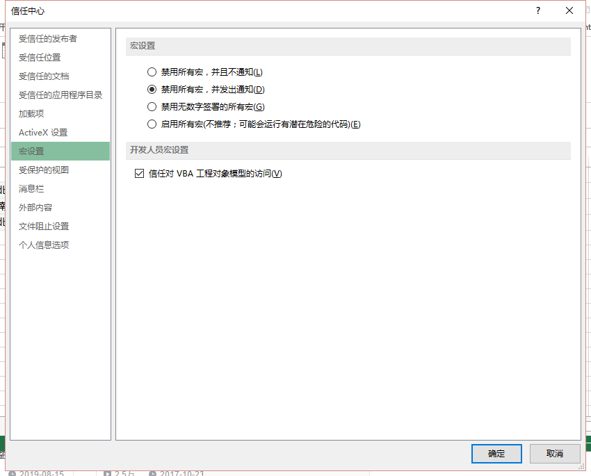
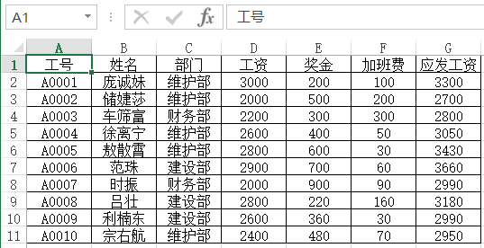
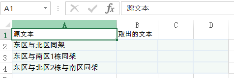

# L01 开篇

[TOC]

---

## 准备工作

- `Excel 2010`

- 设置宏安全性：【开发工具】-【宏安全性】-【宏设置】




录制宏的目的：**方便后期优化**


## 案例1：录制宏为工资单添加表头



### 要求：

录制宏，在各条工资明细上方重复表头，且间隔一空行

### 步骤：

1. 录制宏，使用**相对引用**
2. 复制第一行
3. 选中第三行，并粘贴复制的行
4. 选中新第三行，插入一空行
5. 选中新第四行，作为下一次操作的起点，结束录制

录制的宏代码在 `模块1` 中：

```visual basic
Sub Macro1()
'
' Macro1 Macro
' EH_Demo_2017-05-03
'
' Keyboard Shortcut: Ctrl+q
'
    Selection.Copy
    ActiveCell.Offset(2, 0).Rows("1:1").EntireRow.Select
    Selection.Insert Shift:=xlDown
    Application.CutCopyMode = False
    Selection.Insert Shift:=xlDown, CopyOrigin:=xlFormatFromLeftOrAbove
    ActiveCell.Offset(1, 0).Rows("1:1").EntireRow.Select
End Sub
```


### 复用宏代码：

1. 选中第一行
2. `F5` 执行宏

**注意：宏代码的执行结果是不可撤回的！**


## 案例2：文本切割（EH 论坛求助帖）



### 要求：

从 `A 与 B 同架` 的字符串结构中批量提取 `A` 与 `B` 到单独的列

### 步骤：

1. 选中第一列，录制宏
2. `数据` → `分列` → `分隔符号` → `其他：与` → `目标区域：$B$2` → `完成`，得到新数据区 `area2`
3. 选中 `area2`，批量替换`同架` 为空

查看宏代码：

```visual basic
Sub SplitText()
'
' SplitText Macro
' EH_Demo_2017-05-03
'
' Keyboard Shortcut: Ctrl+w
'
    Application.CutCopyMode = False
    Selection.TextToColumns Destination:=ActiveCell.Offset(0, 1).Range("A1"), _
        DataType:=xlDelimited, TextQualifier:=xlDoubleQuote, ConsecutiveDelimiter _
        :=False, Tab:=True, Semicolon:=False, Comma:=False, Space:=False, _
        Other:=True, OtherChar:="与", FieldInfo:=Array(Array(1, 1), Array(2, 1), Array _
        (3, 1)), TrailingMinusNumbers:=True
    ActiveCell.Offset(0, 1).Range("A1:C3").Select
    Selection.Replace What:="同架", Replacement:="", LookAt:=xlPart, _
        SearchOrder:=xlByRows, MatchCase:=False, SearchFormat:=False, _
        ReplaceFormat:=False
End Sub
```


## 其他辅助操作

### 1. 按钮绑定宏

方便直接从 `Excel` 环境运行宏

### 2. 另存为带宏的 Excel 文件（`*.xlsm`）


---

## 相关快捷键

进入 VBE：`Alt + F11`

插入模块：`Alt + I + M`


## 编写 VBA 版 Hello World

```visual basic
Option Explicit
'VBA 的注释语句 英文单引号

Sub 你好世界()
    MsgBox "你好 VBA ！"
    MsgBox "我们今天开始了 VBA 的旅程"
    MsgBox "今天晚上的肉饼很好吃"
End Sub
```

VBA 语句注释：英文单引号 `'`、或 `Rem` 

结构化程序语言三大结构：

- 顺序
- 分支（选择）
- 循环

VBA 语句的结束标志：换行（回车）

```html
编程语言 = 算法 + 数据结构 = 语句 + 表达式 + 变量
```

标识符命名规则：（过程名与变量名都是标识符）

1. 可以是英文或中文，不能以数字开头，不能包含符号
2. 标识符对英文大小写**不敏感**


要点小结：

1. 录制宏时注意终点的设置，要便于连续操作；
2. 变量名对大小写**不敏感**，重名变量以最后声明为准；
3. VBA 注释的两种方式：单引号 `'` 及关键字 `Rem`，VBA 无多行注释；
4. 结构化程序语言三大结构：顺序、分支（选择）、循环；


复习时间：

1. 22:51 2019/11/24
2. 13:38 2019/11/30


