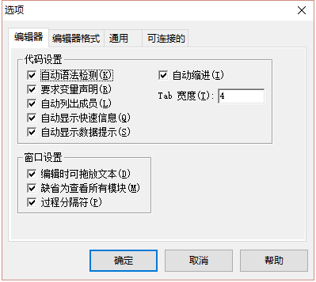
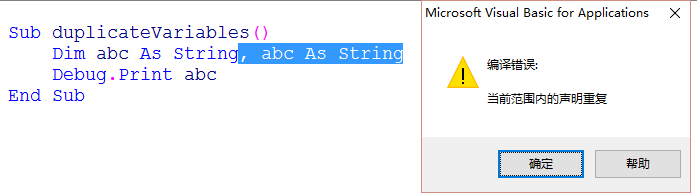
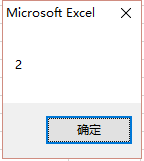
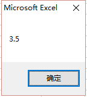

# L02 变量A

[TOC]

## 1. 变量定义

在内存中开辟的装载数据的一些区域（用单元格类比变量）

## 2. 变量声明

声明变量：

1. 给变量起一个名字，通过这个变量名找到变量的值（寻址）；
2. 变量是有数据类型的；

`Excel` 的单元格的值，默认都是**变体型数据**（`Variant`）

语法：

```vb
Dim 变量名 As 数据类型
```

举例：

```visual basic
Sub 变体型变量的声明()
    Dim 总统套房
    '注意等号在这里不是相等的意思，赋值号（语句前省略了Let关键字）
    '表示把等号右边的数据装到等号左边来
    总统套房 = "陈老师夫妇住了进来。"
    总统套房 = "陈太太出去了，就剩下陈老师。"
    总统套房 = "陈老师找了两个女孩子来斗地主。"
    总统套房 = "房间里只有陈老师和2个女孩子，一共3个人。"
	MsgBox 总统套房
End Sub
```
注意：变量的赋值操作是**覆盖操作**


## 3. 变量的显式声明与隐式声明

VBE 设置：【工具】 -- 【选项】 -- 【编辑器】：



设置后，顶部新增语句：`Option Explicit`

- 显示声明：用 `Dim ... As`

- 隐式声明：直接使用


## 4. 变量名在同一区域内是不能重复的

验证：

```vb
Sub duplicateVariables()
    Dim abc As String, abc As String
    Debug.Print abc
End Sub
```

运行结果：




## 5. 常见的数字型数据类型

整数：整型 `Integer` 长整型 `Long`

小数：双精度浮点型 `Double`

示例：

```vb
Sub 整型变量()
    Dim num As Long
    num = 1.5
    MsgBox num
End Sub
```

运行结果：



VBA 中的整型修约规则： **四舍六入五成双**（百度百科）——

- 被修约的数字小于 5 时，该数字舍去；
- 被修约的数字大于 5 时，则进位；
- 被修约的数字等于 5 时，要看 5 前面的数字：
  - 若是奇数，则进位；
  - 若是偶数，则将 5 舍掉。


### Integer vs Long

整型和长整型都是精确值

64 位系统，建议使用 `Long`，便于寻址，对齐时节约时间


### 数据类型的简写

- 字符串：`$`
- 整型：`%`
- 长整型：`&`
- 单精度浮点数：`!`
- 双精度浮点数：`#`
- 货币型：`@`

```visual basic
Sub duplicateVariables()
    '$: String
    Dim str$
    '%: Integer
    Dim n%
    '&: Long
    Dim l&
    '!: Single
    Dim sgl!
    '#: Double
    Dim dbl#
    '@: Currency
    Dim curr@
End Sub
```


### Double 类型：双精度浮点型

是 VBA 中表示数据范围最大，精度也较高的数据类型 9E+307

---

> **随堂练习1**：
>
> 我们要声明一个变量装载 Excel 2003 的工作表所有行数，请问下列声明语句是否有问题？(如果有问题，应该如何改正？）

```vb
Dim sheetRow as Integer
```

答：有问题。Excel 2003 最大行数为 65536，Integer 型最大支持 63767。应改为：

```vb
Dim sheetRow as Long
```


> **随堂练习2**：
>
> 一个月有30天，我们用下面两个声明变量语句是否正确？  

```vb
Dim monthDays as Integer 
Dim monthDays as Long
```

答：都正确。


> **随堂练习3**：
>
> 我们应该使用什么变量来声明员工的实发工资？

- [ ] 整数类型（`Integer` 或 `Long`）

- [ ] 浮点数小数类型（`Double`）

答：选 `Double` 型。


> **随堂练习4**：
>
> 以下哪个变量能装的数最大？

```vb
Sub 随堂练习4()
    Dim 包子 As Integer, 馄饨 As Long
    Dim 油条 As Double
    包子 = 6
    油条 = 1.5
    馄饨 = 4
End Sub
```

答：`Double` 型变量 `油条`。

---


## 6. 运算符与表达式

运算符：

- `+`：加
- `-`：减
- `*`：乘
- `/`：除
- `^`：乘方
- `mod`：取余（注意与 Excel 中的 mod 函数区分开：`mod(5, 2) = 1` 等效于 `5 mod 2 = 1`）
- `\`：整除

表达式：含有运算符的式子

优先级：先乘除后加减


## 7. 混合数据类型运算的规则

混合运算：指运算表达式中有整数型变量和小数型变量等不同数据类型共同参与的运算。

混合运算的隐含数据转换规则：

- 从较小的数据类型**自动转换**成较大的数据类型进行运算；
- 如果将较大的数据类型（如 `Double` 型）的运算结果装入较小的类型变量中（如 `Long` 型），会产生精度损失（应尽量规避这种情况的发生）

```vb
Sub 混合数据类型运算() 
    '混合运算数据类型自动向大的类型转换
    Dim num As Long, num1 As Double
    num = 2
    num1 = 1.5
    MsgBox num + num1
End Sub
```

运行结果：



注意：CPU 计算时，会为 num 与 num1 分别开辟存储区域存放值和对应的数据类型；num + num1 的计算结果值也会另行开辟空间，其类型为较精确、取值范围较大的那个数据类型。


---

---

## 作业：

1. 女生李小萌身高 165cm，已知厘米和英寸的换算规则是：英寸 = 厘米 / 2.54，编程计算李小萌的身高是多少英寸？
   1. 要求定义一个字符串变量表示姓名，定义一个什么变量表示身高，定义一个变量表示结果英寸数；
   2. 用 `MsgBox` 语句和连接字符串的方式显示李小萌的身高是多少英寸。
2. 求平均年龄：
   1. 定义三个变量存储三个姓名：王晓红，周俊丽，吴三胖；
   2. 再定义三个变量存储三人的年龄，分别是11、14、13；
   3. 用 `MsgBox` 语句分别显示三人的年龄；
   4. 最后用 `MsgBox` 语句显示三人的平均年龄（要求只精确到整数）；

3. 计算年龄的秒数：一年大约是 3.156 × 10<sup>7</sup> 秒，老张今年 34 岁，请使用 `MsgBox` 语句输出老张的年龄是多少秒。

```vb
'作业01：（2017-05-05 安冬 UID:1700565）
'1.计算英寸身高并显示结果
Sub Homework01_1()
    Dim missName As String
    Dim hightCm As Integer
    Dim hightInch As Double
    
    missName = "李小萌"
    hightCm = 165
    hightInch = 165 / 2.54
    MsgBox missName & "的身高是 " & Format(hightInch, "#.00") & " 英寸"
    '用Format()处理显示位数过长的问题，文本用 & 连接
End Sub
```

```vb
'2.求平均年龄
Sub Homework01_2()
    Dim nameA As String, nameB As String, nameC As String
    Dim ageA As Integer, ageB As Integer, ageC As Integer
    
    Dim ageAvg As Byte   '存放四舍五入后的平均年龄
    
    nameA = "王晓红"
    nameB = "周俊丽"
    nameC = "吴三胖"
    ageA = 11
    ageB = 14
    ageC = 13
    
    '考虑舍入计算平均年龄，结果强制存入 ageAvg 整型变量完成四舍五入
    ageAvg = (11 + 14 + 13) / 3
    
    MsgBox nameA & "的年龄为 " & ageA & " 岁。", vbInformation, "第一个人"
    MsgBox nameB & "的年龄为 " & ageB & " 岁。", vbInformation, "第二个人"
    MsgBox nameC & "的年龄为 " & ageC & " 岁。", vbInformation, "第三个人"
    
    '分情况表示平均年龄
    MsgBox "三人的平均年龄：" & vbCrLf & _
           "(1)截尾取整后，为 " & ((ageA + ageB + ageC) \ 3) & " 岁；" & vbCrLf & _
           "(2)四舍五入后，为 " & ageAvg & " 岁。"
End Sub
```

```vb
'3. 计算年龄的秒数
Sub Homework01_3()
    Dim hisName As String
    Dim hisAge As Integer
    Dim secondsPerYear As Long
    
    hisName = "老张"
    hisAge = 34
    secondsPerYear = 365.25 * 60 * 60 * 24  '年数置首位，防止结果溢出 Integer 型变量上限
    
    MsgBox hisName & "的年龄是 " & (secondsPerYear * hisAge) & " 秒。"
End Sub
```

---

【作业小结】

1. 关于数字格式化函数 `Format`：

   > 语法
   >
   > **Format**(*Expression*, [ *Format* ], [ *FirstDayOfWeek* ], [ *FirstWeekOfYear* ])

   ```visual basic
   ' Example extracted from office doc
   Dim MyTime, MyDate, MyStr
   MyTime = #17:04:23#
   MyDate = #January 27, 1993#
   
   ' Returns current system time in the system-defined long time format.
   MyStr = Format(Time, "Long Time")
   
   ' Returns current system date in the system-defined long date format.
   MyStr = Format(Date, "Long Date")
   
   MyStr = Format(MyTime, "h:m:s")            ' Returns "17:4:23".
   MyStr = Format(MyTime, "hh:mm:ss am/pm")   ' Returns "05:04:23 pm".
   MyStr = Format(MyTime, "hh:mm:ss AM/PM")   ' Returns "05:04:23 PM".
   MyStr = Format(MyDate, "dddd, mmm d yyyy") ' Returns "Wednesday, Jan 27 1993".
   ' If format is not supplied, a string is returned.
   MyStr = Format(23)                         ' Returns "23".
   
   ' User-defined formats.
   MyStr = Format(5459.4, "##,##0.00") ' Returns "5,459.40".
   MyStr = Format(334.9, "###0.00")    ' Returns "334.90".
   MyStr = Format(5, "0.00%")          ' Returns "500.00%".
   MyStr = Format("HELLO", "<")        ' Returns "hello".
   MyStr = Format("This is it", ">")   ' Returns "THIS IS IT".
   ```

2. 关于计算出生天数的方式

   已知日期范围的起点和终点（字符串形式），则经历的天数可以直接使用日期型相减：

   ```vb
   Sub countDays()
       Dim days&, b As Date, c As Date
       b = Date               ' i.e. 2019/11/30
       c = CDate("1997/7/1")
       days = b - c
       Debug.Print days       ' Returns 8187
   End Sub
   ' Solution from ExcelHome forum:
' rq = CDate(Format("20171024", "0000-00-00"))
   ```

   关于日期转换函数 `CDate`：
   
   > 语法
   >
   > **CDate**(*expression*)
>
   > This example uses the **CDate** function to convert a string to a **Date**. In general, hard-coding dates and times as strings (as shown in this example) is not recommended. Use date literals and time literals, such as `#2/12/1969#` and `#4:45:23 PM#`, instead.
   
   ```vb
   Dim MyDate, MyShortDate, MyTime, MyShortTime 
   MyDate = "February 12, 1969"  ' Define date. 
   MyShortDate = CDate(MyDate)   ' Convert to Date data type. 
    
   MyTime = "4:35:47 PM"         ' Define time. 
MyShortTime = CDate(MyTime)   ' Convert to Date data type. 
   ```


整理于：

1. 1:43 2019/11/25
2. 14:45 2019/11/30

